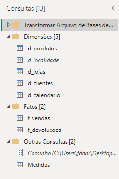
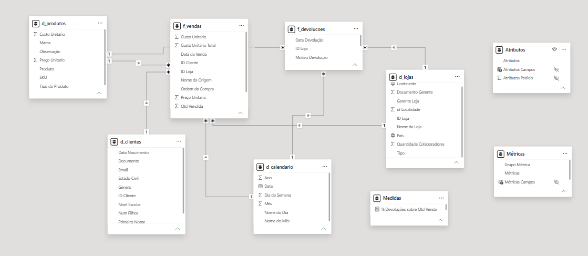
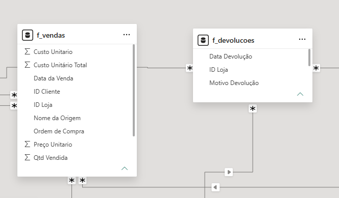
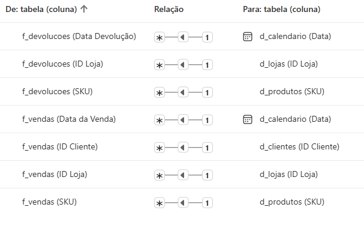
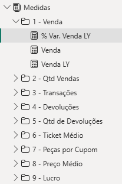
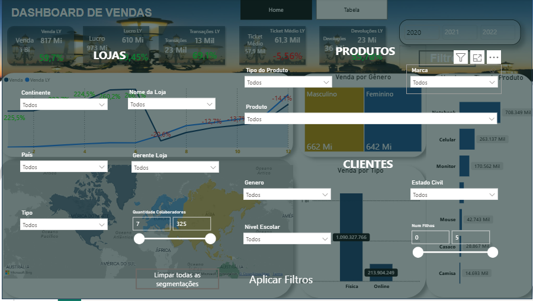
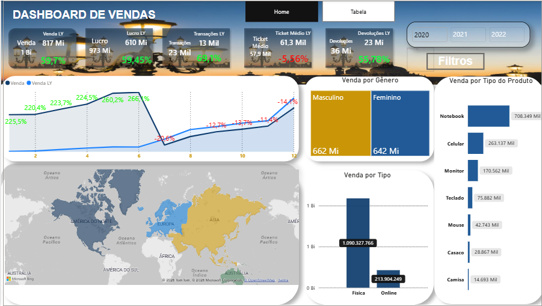
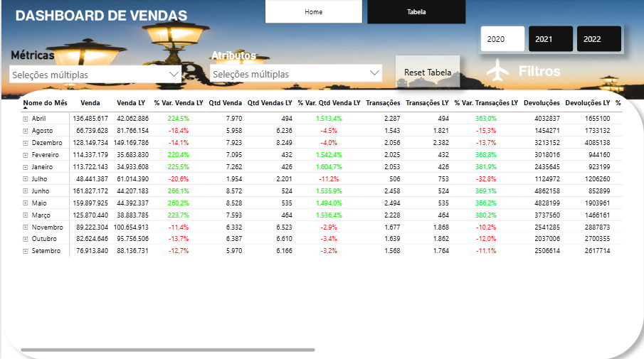

# Power BI - Documentação Técnica do Relatório

## 1. Visão geral

Este diretório contém o arquivo do relatório desenvolvido em **Microsoft Power BI**.

O relatório foi desenvolvido a partir dos **dados tratados durante o processo de preparação do projeto**, utilizando o Power Query, modelagem de dados e DAX para transformar os dados operacionais em informações analíticas.

O objetivo da solução é permitir o acompanhamento de **vendas, desempenho, metas e indicadores de negócio**, proporcionando uma visão consolidada e possibilitando análises detalhadas por diferentes dimensões.

O desenvolvimento considerou boas práticas de:

* tratamento e preparação dos dados;
* Power Query;
* modelagem dimensional;
* separação entre tabelas fato e dimensão;
* definição de relacionamentos;
* criação de medidas DAX;
* organização do modelo;
* construção de indicadores;
* visualização e experiência do usuário.

---

# 2. Fluxo do projeto

O desenvolvimento do relatório faz parte de um processo estruturado de preparação, modelagem e análise dos dados.

```text
Dados de origem
      │
      ▼
Tratamento dos dados
      │
      ▼
Power Query
      │
      ▼
Modelo de dados
      │
      ├── Tabelas fato
      └── Tabelas dimensão
      │
      ▼
Medidas DAX
      │
      ▼
Relatório Power BI
```

# 2.1 - Arquitetura do Modelo:


```
                    DimProdutos
                        │
                        │
DimCalendário ──── FatoVendas/Dev ──── DimClientes
                        │
                        │
                     DimLojas
```

> A separação das etapas permite organizar o processo de preparação dos dados, modelagem e visualização de forma independente.

---

# 3. Dados utilizados

O relatório foi desenvolvido utilizando os **dados tratados durante o processo de preparação do projeto**.

Os dados de origem foram submetidos às etapas necessárias de tratamento antes de serem utilizados na construção do modelo analítico.

Entre os procedimentos realizados estão:

* tratamento dos dados;
* padronização;
* adequação dos tipos de dados;
* preparação das estruturas utilizadas no modelo;
* remoção de informações desnecessárias;
* tratamento de inconsistências;
* preparação das informações para análise.

A etapa de preparação tem como objetivo garantir que os dados estejam adequados para utilização no Power BI.

---

# 4. Power Query

O **Power Query** foi utilizado para realizar as transformações necessárias antes da disponibilização dos dados no modelo do Power BI.

As etapas de transformação foram organizadas de forma a manter o processo de preparação dos dados separado da camada analítica.

### Fluxo de tratamento

```text
Fonte de dados
     │
     ▼
Importação
     │
     ▼
Tratamento
     │
     ▼
Padronização
     │
     ▼
Modelo Power BI
```

Entre os tratamentos realizados estão:

* definição dos tipos de dados;
* transformação de colunas;
* padronização de informações;
* tratamento de valores nulos;
* remoção de campos desnecessários;
* criação de campos derivados quando necessário.

### Evidência



---

# 5. Modelagem de dados

Após a preparação dos dados, o modelo foi estruturado considerando princípios de **modelagem dimensional**.

A organização busca separar:

* **tabelas fato**, responsáveis pelos eventos e métricas;
* **tabelas dimensão**, responsáveis pelos atributos utilizados para análise.

Essa estrutura facilita a utilização de filtros, segmentações e medidas, além de contribuir para um modelo mais organizado e previsível.



---

# 6. Tabela fato

A tabela fato concentra os registros relacionados aos eventos analisados pelo relatório.

- **Tabela fato principal:** `[fVendas]`
- **Tabela fato principal:** `[fDevoluções]`

**Responsabilidade:** `[Registra dados qualitativos e quantitativos]`



> A tabela fato contém os registros e métricas utilizados para realizar as principais análises do relatório.

---

# 7. Tabelas dimensão

As tabelas dimensão fornecem o contexto necessário para segmentar e analisar os registros da tabela fato.

| Tabela   | Tipo     | Responsabilidade |
| -------- | -------- | ---------------- |
| `[dClientes]` | Dimensão | `[Características dos clientes]`    |
| `[dProdutos]` | Dimensão | `[Características dos produtos]`    |
| `[dCalendário]` | Dimensão | `[Apresenta todas as datas do ano]`    |
| `[dLojas]` | Dimensão | `[Apresenta as localidades e características das regiões]`    |

As dimensões são utilizadas principalmente em:

* filtros;
* segmentações;
* eixos de gráficos;
* agrupamentos;
* análises comparativas.

---

# 8. Relacionamentos

Os relacionamentos foram definidos considerando a estrutura do modelo dimensional.

Foram considerados:

* chaves utilizadas entre as tabelas;
* cardinalidade;
* direção de filtragem;
* relacionamento entre dimensões e fatos;
* prevenção de relacionamentos ambíguos;


Sempre que aplicável, as tabelas dimensão atuam como origem dos filtros sobre a tabela fato.




---

# 9. Medidas DAX

As métricas analíticas do relatório foram desenvolvidas utilizando **DAX**.

As medidas concentram a lógica de negócio e podem ser reutilizadas em diferentes elementos visuais.

Entre os indicadores desenvolvidos estão métricas relacionadas a:

* vendas;
* metas;
* desempenho;
* percentuais;
* médias;
* comparativos;
* rankings;
* indicadores de performance.

### Exemplo

```DAX
% Var. Venda LY = 
Var Atual = [Venda]
Var LY = [Venda LY]
Return
DIVIDE((Atual - LY), LY)
```

> A utilização de medidas permite manter os cálculos analíticos centralizados no modelo e evita a duplicação desnecessária da lógica de negócio.



---

# 10. Construção do relatório

A camada visual foi construída a partir do background feito do **Microsoft PowerPoint**.


---

# 11. Páginas do relatório

## `[Home]`

**Objetivo:**
`[Descrever qual pergunta de negócio a página responde.]`

**Principais elementos:**

* `[Indicadores ( cartões )]`
* `[Gráficos ( Barras)]`
* `[Filtragem]`



---

## `[Tabela]`

**Objetivo:**
`[Descrever qual pergunta de negócio a página responde.]`

**Principais elementos:**

* `[Tabela Matriz/visual]`
* `[Filtragem]`




---

# 12. Boas práticas aplicadas

## Dados

* tratamento dos dados antes da análise;
* padronização das informações;
* definição adequada dos tipos/colunas de dados;
* remoção de informações desnecessárias;
* anonimização dos dados destinados à publicação.

## Power Query

* utilização do Power Query para preparação dos dados;
* organização das etapas de transformação;
* tratamento dos dados antes da camada analítica;
* redução de transformações desnecessárias no modelo.

## Modelagem

* utilização de modelo dimensional;
* separação entre tabelas fato e dimensão;
* definição explícita dos relacionamentos;
* atenção à cardinalidade;
* utilização adequada da direção de filtragem;
* redução de ambiguidades.

## DAX

* utilização de medidas para cálculos analíticos;
* centralização da lógica de negócio;
* reutilização das métricas;
* organização das medidas.

## Visualização

* hierarquia visual;
* padronização dos elementos;
* utilização adequada de filtros;
* escolha dos visuais de acordo com o objetivo da análise;
* foco na interpretação dos indicadores.

---

# 13. Dados para publicação

Os dados originais utilizados no desenvolvimento do projeto **não são disponibilizados publicamente**.

Para permitir o versionamento e a demonstração do projeto no GitHub, foi criada uma camada de dados de demonstração na pasta:

```text
data/
└── sample/
```

Essa camada contém uma **amostra dos dados tratada e adequada para disponibilização pública**, sem exposição dos dados originais que possam conter informações sensíveis.

### Fluxo de disponibilização:

```text
Dados originais
      │
      ▼
 Tratamento
      │
      ▼
Dados utilizados no desenvolvimento
      │
      ▼
 Amostragem 
      │
      ▼
 data/sample
      │
      ▼
    GitHub
```

A pasta `data/sample` tem, portanto, finalidade de **demonstração, reprodução e versionamento público**. Ela não representa necessariamente a fonte original utilizada na construção do relatório.

---

# 14. Performance

Durante a construção do modelo foram consideradas práticas voltadas à eficiência e manutenção do Power BI.

Entre elas:

* evitar campos desnecessários;
* realizar transformações na etapa adequada;
* manter o modelo dimensional organizado;
* evitar relacionamentos desnecessários;
* utilizar medidas para cálculos analíticos;
* reduzir a complexidade do modelo quando possível.

A preocupação com performance deve ocorrer desde a preparação dos dados até a construção do modelo e dos elementos visuais.

---

# 15. Resultado

O resultado é um relatório analítico desenvolvido para transformar dados operacionais em informações estruturadas para acompanhamento de desempenho e apoio à tomada de decisão.
A solução combina preparação de dados, modelagem, cálculos analíticos e visualização em uma única camada de Business Intelligence.

---

# 16. Tecnologias utilizadas

* **Microsoft Power BI**
* **Power Query / linguagem M**
* **DAX**

---

# Conclusão

Este relatório representa a camada de análise e visualização do projeto.

A solução parte dos dados tratados utilizados durante o desenvolvimento e aplica um processo estruturado de **Power Query, modelagem dimensional, relacionamentos, DAX e visualização**.

Para fins de publicação e versionamento, uma amostra dos dados foi posteriormente preparada e disponibilizada em `data/sample`, permitindo demonstrar a estrutura do projeto sem expor os dados originais.

O projeto demonstra, portanto, não apenas a construção de um dashboard, mas a aplicação de boas práticas de **preparação de dados, modelagem, análise e Business Intelligence**.
