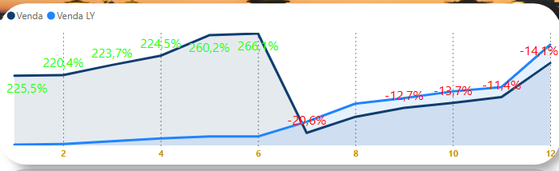
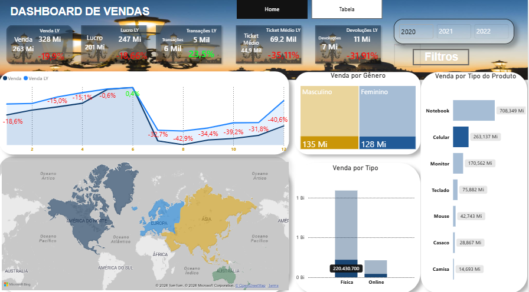

# 📊 Análise de Vendas e Performance Comercial

> Projeto de Business Intelligence desenvolvido com Power BI para transformar dados operacionais de vendas, devoluções e clientes em informações para suporte à tomada de decisão.

---

## 📌 Sobre o projeto

Este projeto simula um cenário de uma empresa varejista que possui uma operação comercial consolidada, mas ainda depende de diferentes arquivos Excel para armazenar informações relacionadas às suas vendas, clientes e devoluções.

Ao longo dos anos, a empresa acumulou dados de vendas referentes aos períodos de **2020, 2021 e 2022**, além de informações cadastrais de clientes e registros de devoluções.

Embora os dados estejam disponíveis, a ausência de uma visão analítica centralizada dificulta a identificação de tendências, oportunidades comerciais e problemas operacionais.

O objetivo deste projeto é desenvolver uma solução de **Business Intelligence utilizando Power BI**, permitindo transformar os dados existentes em indicadores e visualizações que apoiem a gestão comercial.

---

## 🏢 Cenário empresarial

Para este estudo de caso, considera-se uma empresa fictícia chamada **NovaComercial**, uma empresa varejista que comercializa produtos para consumidores de diferentes regiões.

A área comercial possui dados históricos de suas operações, porém as informações são mantidas em arquivos separados.

Atualmente, a gestão precisa consultar diferentes planilhas para responder perguntas simples como:

* Quanto a empresa vendeu em determinado período?
* Como as vendas evoluíram ao longo dos anos?
* Quais produtos apresentam melhor desempenho?
* Quais clientes possuem maior participação nas vendas?
* Quais regiões apresentam melhor desempenho comercial?
* Qual é o impacto das devoluções sobre as vendas?
* Em quais períodos houve crescimento ou queda nas vendas?
* Quais segmentos da operação precisam de maior atenção?

---

# ❗ Problema de negócio

A empresa possui um volume relevante de informações comerciais, mas os dados estão distribuídos em diferentes arquivos e períodos.

A inexistência de uma visão consolidada gera alguns problemas:

### 1. Dados descentralizados

As informações de vendas estão separadas por período, enquanto os dados de clientes e devoluções estão armazenados em outras fontes.

Isso dificulta a análise integrada da operação.

### 2. Baixa visibilidade da performance

A gestão não possui uma visão única para acompanhar indicadores comerciais e identificar rapidamente alterações no desempenho.

### 3. Dificuldade para identificar tendências

Sem uma análise histórica estruturada, torna-se mais difícil compreender:

* evolução das vendas;
* sazonalidade;
* períodos de crescimento;
* períodos de queda;
* comportamento dos clientes;
* desempenho dos produtos.

### 4. Impacto das devoluções

Analisar apenas o volume vendido pode gerar uma visão incompleta da operação.

As devoluções precisam ser analisadas em conjunto com as vendas para identificar possíveis impactos no resultado comercial.

### 5. Dependência de análises manuais

A consolidação de informações em planilhas aumenta o esforço operacional e dificulta a atualização dos indicadores.

---

# 🎯 Objetivo da solução

Desenvolver um **Dashboard de Vendas em Power BI** capaz de consolidar os dados comerciais da empresa e disponibilizar uma visão analítica para acompanhamento da operação.

A solução busca transformar dados brutos em informações úteis para diferentes níveis de decisão:

**Dados → Tratamento → Modelo de dados → Indicadores → Visualização → Decisão**

---

# 💡 Solução proposta

A solução utiliza o **Power BI** como camada de análise e visualização.

Os dados provenientes dos arquivos Excel são tratados e organizados para formar um modelo analítico capaz de relacionar diferentes aspectos da operação comercial.

### Fluxo da solução

```text
                 ┌─────────────────────┐
                 │   Arquivos Excel    │
                 └──────────┬──────────┘
                            │
                            ▼
                 ┌─────────────────────┐
                 │   Power Query / M   │
                 │ Tratamento dos dados│
                 └──────────┬──────────┘
                            │
                            ▼
                 ┌─────────────────────┐
                 │    Modelo de dados  │
                 │       Power BI      │
                 └──────────┬──────────┘
                            │
                            ▼
                 ┌─────────────────────┐
                 │         DAX         │
                 │     Indicadores     │
                 └──────────┬──────────┘
                            │
                            ▼
                 ┌─────────────────────┐
                 │ Dashboard de Vendas │
                 └──────────┬──────────┘
                            │
                            ▼
                 ┌─────────────────────┐
                 │  Tomada de decisão  │
                 └─────────────────────┘
```

---

# 📂 Fontes de dados

O projeto inicial utiliza diferentes arquivos para representar as principais fontes de informação da operação.

| Fonte                     | Descrição                           |
| ------------------------- | ----------------------------------- |
| `Base Vendas - 2020.xlsx` | Dados de vendas do ano de 2020      |
| `Base Vendas - 2021.xlsx` | Dados de vendas do ano de 2021      |
| `Base Vendas - 2022.xlsx` | Dados de vendas do ano de 2022      |
| `Base Devoluções.xlsx`    | Registros de devoluções             |
| `Cadastro Clientes.xlsx`  | Informações cadastrais dos clientes |
| `Cadastro Localidades.xlsx`  | Informações cadastrais dos clientes |
| `Cadastro Lojas.xlsx`  | Informações cadastrais dos clientes |
| `Cadastro Produtos.xlsx`  | Informações cadastrais dos clientes |

> **Importante:** os arquivos contendo dados de clientes e outras informações potencialmente sensíveis não devem ser disponibilizados publicamente no repositório. Para publicação no GitHub, devem ser utilizados dados anonimizados, dados sintéticos ou apenas estruturas/amostras sem informações pessoais.

---

## 🔐 Segurança e Proteção de Dados

As fontes originais utilizadas durante o desenvolvimento não são disponibilizadas no repositório, pois podem conter informações pessoais e dados que não devem ser publicados.

Entre os campos identificados nas fontes originais estão informações como:

- Nome;
- Sobrenome;
- E-mail;
- Data de nascimento;
- Documento;
- Nome de gerente;
- Documento de gerente.

> Essas informações são mantidas fora do repositório público.

## Sample

Para permitir que outras pessoas compreendam a estrutura dos dados sem expor informações pessoais, foi criada uma versão reduzida das bases em:

```data/sample/```

O sample utiliza os próprios dados de origem, porém com:

- quantidade reduzida de registros;
- remoção de campos de identificação pessoal;
- manutenção das principais informações necessárias para demonstrar a estrutura das bases.

A geração do sample é realizada por um script Python separado.

```
data/
├── data_source/
│   └── arquivos originais
│
└── sample/
    └── arquivos reduzidos para demonstração
```

***Os arquivos originais permanecem no ambiente local e não devem ser versionados no Git.***

# 📈 Indicadores

O dashboard foi desenvolvido para permitir o acompanhamento de indicadores comerciais e análises históricas.

Entre as principais análises estão:

* faturamento;
* quantidade de vendas;
* evolução das vendas;
* desempenho por período;
* desempenho por produto;
* desempenho por cliente;
* análise de devoluções;
* participação relativa nas vendas;
* comparação entre períodos;
* identificação de melhores e piores desempenhos.

Os indicadores são calculados utilizando **medidas DAX**, permitindo que os resultados sejam atualizados dinamicamente conforme os filtros aplicados no relatório.

---

# 🔎 Perguntas de negócio respondidas

A solução foi construída para responder perguntas como:

### Performance comercial

> Qual foi o desempenho das vendas ao longo do período analisado?

"No acumulado do ano, as vendas de 2022 registraram um crescimento de 59,7% em relação a 2021. No entanto, a análise mensal mostra uma forte mudança de comportamento a partir de julho: enquanto o primeiro semestre apresentou altas expressivas (superiores a 200%), o segundo semestre registrou quedas em relação ao ano anterior (LY), com destaque para julho (-20,6%) e oscilações negativas entre -11% e -14% nos meses seguintes."





### Produtos

> Quais produtos apresentam maior participação nas vendas?

No ano de 2022, o produto com maior participação disparada nas vendas foram os Notebooks, registrando R$ 708,3 milhões em faturamento. Esse desempenho representou um crescimento expressivo de 107,0% em relação ao ano anterior (LY). Na sequência, completam o ranking de maiores vendas os Celulares (R$ 263,1 milhões) e os Monitores (R$ 170,5 milhões).

Análise de Desempenho: Categoria de Celulares
Com base nos dados filtrados no dashboard para a categoria de Celulares, destacam-se os seguintes insights de negócio:

Retração no Faturamento e Lucro: As vendas totalizaram R$ 263 milhões, o que representa uma queda de 19,9% em comparação com o ano anterior (LY: R$ 328 milhões). O lucro acompanhou essa redução, fechando em R$ 201 milhões (uma queda de 18,66% frente aos R$ 247 milhões do período anterior).

Aumento de Transações vs. Queda no Ticket Médio: Apesar da queda na receita geral, o volume de operações cresceu, com as transações subindo 23,5% (de 5 mil para 6 mil). No entanto, o ticket médio despencou 35,11% (passando de R$ 69,2 mil para R$ 44,9 mil), indicando que a base de clientes comprou mais vezes, mas optou por aparelhos de menor valor unitário.

Queda Expressiva nas Devoluções: Um indicador bastante positivo foi a redução de 31,91% nas devoluções, que caíram de R$ 11 milhões para R$ 7 milhões, refletindo possivelmente um ganho em qualidade ou alinhamento de expectativas do produto entregue.

Canais de Venda e Perfil de Consumo: A modalidade de loja Física é o principal motor de escoamento da categoria, somando aproximadamente R$ 220,4 milhões frente ao canal online. No perfil demográfico, as vendas apresentam boa paridade, com leve vantagem para o público Masculino (R$ 135 milhões) em relação ao Feminino (R$ 128 milhões).



### Clientes

> Como as vendas se distribuem entre o público masculino e feminino?

Há um equilíbrio muito próximo entre os públicos, com o segmento Masculino gerando R$ 662 milhões e o Feminino alcançando R$ 642 milhões.

### Gestão

> Quais áreas da operação apresentam oportunidades de melhoria?

Houve alterações no ticket médio e no volume de devoluções. O ticket médio sofreu uma leve retração de -5,56%, fechando em R$ 57,9 mil. Por outro lado, as devoluções aumentaram para R$ 36 milhões, representando um crescimento de 55,78% em relação ao patamar anterior (23 milhões).

---

# 📊 Dashboard

O resultado final é um **Dashboard de Vendas desenvolvido no Power BI**, permitindo que o usuário explore os dados de maneira interativa por meio de filtros e diferentes visualizações.

A proposta é substituir análises manuais e fragmentadas por uma visão centralizada da operação.

### Principais características

* filtros interativos;
* indicadores de desempenho;
* análises temporais;
* visualizações comerciais;
* análise de devoluções;
* navegação dinâmica;
* visão consolidada dos dados.

---

## 🛠️ Tecnologias utilizadas

## Dados e Preparação:

* **Python**
* **Pandas**
* **OpenPyXL**
* **Excel**

## Análise e Visualização:

* **Power BI**
* **Power Query**
* **DAX**

---

## 📂 Estrutura do Projeto
```text
project_powerbi_sales/
│
├── data/
│   ├── data_source/
│   │     └── arquivos originais
│   │
│   └── sample/
│         └── arquivos para demonstração
│
├── Scripts/
│   ├── 1.localizar_arquivos.py
│   ├── 2.inspecionar_estrutura.py
│   ├── 3.analisar_conteudo.py
│   └── generate_sample.py
│
├── PowerBI/
│      └── relatório Power BI
│
├── .gitignore
└── README.md
```

> Os dados originais contendo informações pessoais ou potencialmente sensíveis não fazem parte do repositório público.

---

### Publicação

**Relatório publicado:**
https://app.powerbi.com/view?r=eyJrIjoiZWVlMDMwNzgtZTZlMy00MjVlLTk0OTgtYWEzMGM5ODk0YWZhIiwidCI6ImVkNTJhZDViLTU0YzktNDNlZi04YmNhLThlOWY4Y2U0Zjc1ZiJ9


## 👨‍💻 Autor

**Daniel Martins França**

***Projeto desenvolvido como parte do portfólio de **Business Intelligence e Análise de Dados**, com foco em modelagem, tratamento de dados, criação de indicadores e visualização utilizando Power BI.***

**Linkedin**: https://www.linkedin.com/in/danixdev
